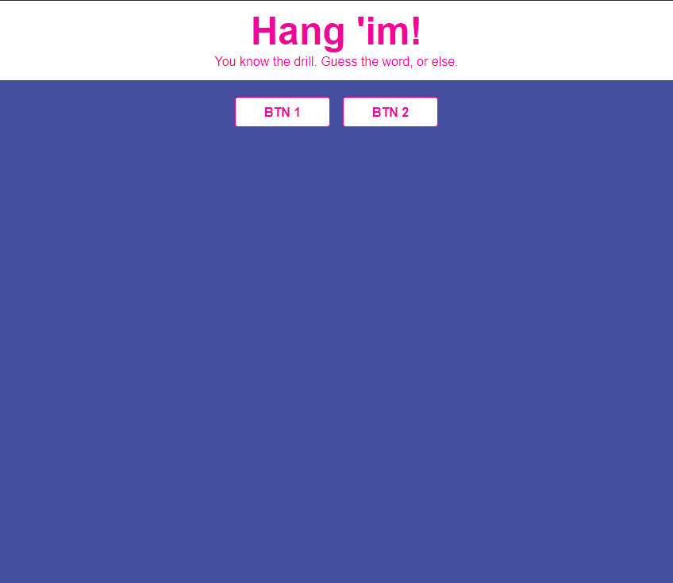

# Exercise 1 - Create initial game state

When the page loads, we should only see the header and the two buttons. The rest of the page should be empty.

Let's start by creating the initial state of the game.

In `App.js`, above of the `App` component declaration, insert this variable declaration:

```js
const initialGameState = { started: false, over: false, win: false };
```

We will use this object to set the initial state of `game`.

In the App component, declare a `useState` for `game` like so:

```js
const [game, setGame] = useState(initialGameState);
```

Now make use of `game.started` to conditionally render the content of the page.

```diff
  <Wrapper>
    {/* <GameOverModal /> */}
    <Header />
    <Nav>
      <Button>btn 1</Button>
      <Button>btn 2</Button>
    </Nav>
+   {game.started && (
      <>
        <Container>
          <Deadman />
          <RightColumn>
            <DeadLetters />
            <TheWord />
          </RightColumn>
        </Container>
        <Keyboard />
      </>
+   )}
  </Wrapper>
```

At this point, you app should look like this:



---

[Back to the README.md](../README.md) 

[Next Exercise](./exercise-2.md)