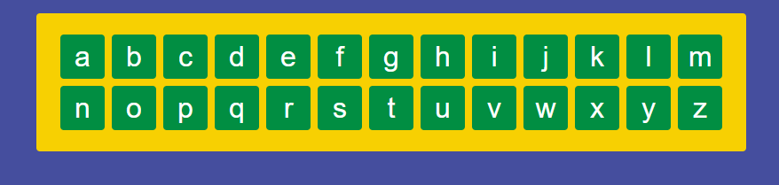

# Exercise 6 - The Keyboard

Time to build out the keyboard! Take a look at the `Keyboard` and `LetterKey` components. You will use these to generate the keyboard.

There is also a data file `data/letters.json` that contains an array of the letters of the alphabet to give something to `map` over.

You should have this when you're done.

> Remember! A component should not return `x` number of things, but instead you should have `x` number of components returning 1 thing each!

---

[Previous Exercise](./exercise-5.md)

[Back to the README.md](../README.md) 

[Next Exercise](./exercise-7.md)