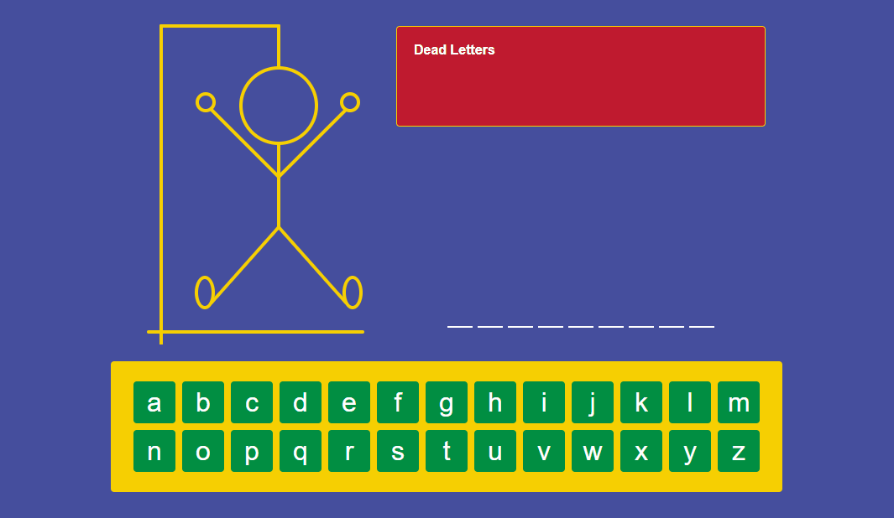

# Exercise 8 - Handle the User Guess

Now that you have almost all of the pieces in place, we need to write the core functionality of the app.

This is what should happen when the user clicks on a letter in the keyboard.

1. User clicks on the letter `b`.
2. This triggers an onClick function called `handleGuess` inside of `App`.
3. This function will
   - Add the letter `b` to `usedLetters`.
   - Check if `b` is in the word,
     - if **YES**, it should replace the `""` with the `"b"` at the right index in `revealed`
     - If **NO**, it should add `"b"` to `wrongGuesses`

By updating the state, it should trigger a re-render of the appropriate components.

Start by creating a `handleGuess` function in `App`, and passing it down to the `LetterKey` component. _`handleGuess` will need to accept a `ltr` parameter._

```js
const handleGuess = (ltr) => {
  // lots of logic in here.
};
```



---

[Previous Exercise](./exercise-7.md)

[Back to the README.md](../README.md) 

[Next Exercise](./exercise-9.md)